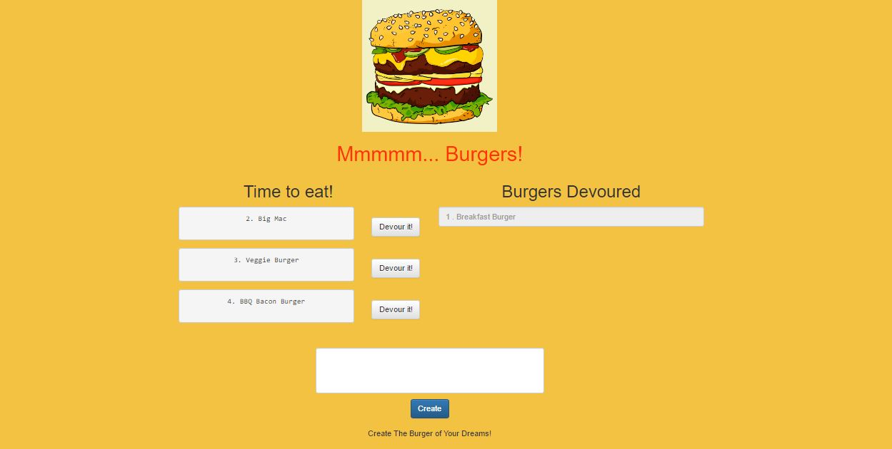
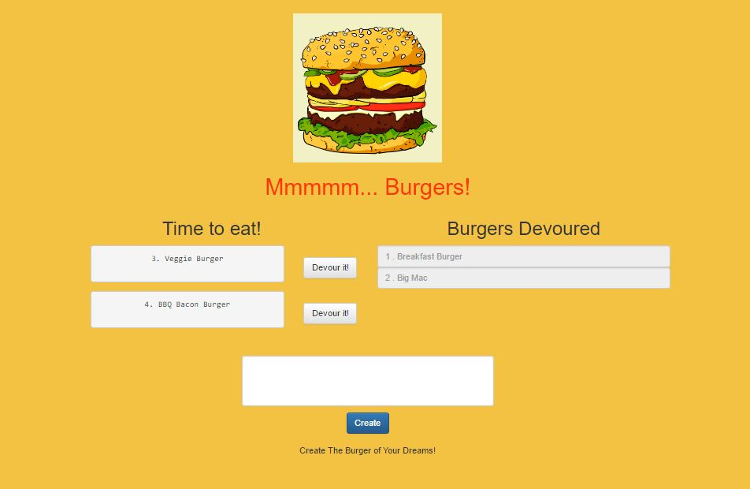
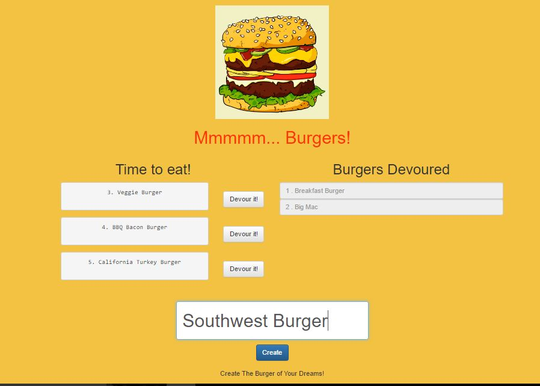
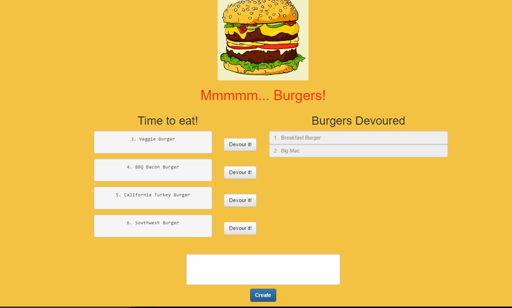

# Eat-The-Burgers App

#### Burger App using Node, Express, Handlebars and our own ORM (Object-relational mapping). It uses the Model–View-Controller (MVC) design pattern, Node and MySQL to query and route data in the app and Handlebars for generating the HTML. 

Link to the Burger App: https://eattheburgers.herokuapp.com/burgers

## How the app functions:
*

##Screen Shots of the app

###

###

###

###
